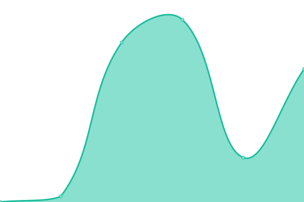

# [📈 Live Status](https://bgord.github.io/statuses): <!--live status--> **🟧 Partial outage**

This repository contains the open-source uptime monitor and status page for [Bartosz Gordon](bartoszgordon.com), powered by [Upptime](https://github.com/upptime/upptime).

With [Upptime](https://upptime.js.org), you can get your own unlimited and free uptime monitor and status page, powered entirely by a GitHub repository. We use [Issues](https://github.com/bgord/statuses/issues) as incident reports, [Actions](https://github.com/bgord/statuses/actions) as uptime monitors, and [Pages](https://bgord.github.io/statuses) for the status page.

<!--start: status pages-->
<!-- This summary is generated by Upptime (https://github.com/upptime/upptime) -->
<!-- Do not edit this manually, your changes will be overwritten -->
<!-- prettier-ignore -->
| URL | Status | History | Response Time | Uptime |
| --- | ------ | ------- | ------------- | ------ |
|  [RAOK](https://raok.bgord.me/healthcheck) | 🟩 Up | [raok.yml](https://github.com/bgord/statuses/commits/HEAD/history/raok.yml) | 

 903ms
     
 | 

<a href="https://bgord.github.io/statuses/history/raok">100.00%</a>
    

|  [SHOWCASE](https://showcase.bgord.me/healthcheck) | 🟥 Down | [showcase.yml](https://github.com/bgord/statuses/commits/HEAD/history/showcase.yml) | 

 779ms
     
 | 

<a href="https://bgord.github.io/statuses/history/showcase">0.00%</a>
    

|  [TRACKERS](https://trackers.bgord.me/healthcheck) | 🟥 Down | [trackers.yml](https://github.com/bgord/statuses/commits/HEAD/history/trackers.yml) | 

 736ms
     
 | 

<a href="https://bgord.github.io/statuses/history/trackers">0.00%</a>
    

|  [LOBBYGOW](https://lobbygow.bgord.me/healthcheck) | 🟩 Up | [lobbygow.yml](https://github.com/bgord/statuses/commits/HEAD/history/lobbygow.yml) | 

 587ms
     
 | 

<a href="https://bgord.github.io/statuses/history/lobbygow">100.00%</a>
    

|  [CORDIAN](https://cordian.bgord.me) | 🟩 Up | [cordian.yml](https://github.com/bgord/statuses/commits/HEAD/history/cordian.yml) | 

 711ms
     
 | 

<a href="https://bgord.github.io/statuses/history/cordian">100.00%</a>
    

<!--end: status pages-->

[**Visit our status website →**](https://bgord.github.io/statuses)

## 📄 License

- Powered by: [Upptime](https://github.com/upptime/upptime)
- Code: [MIT](./LICENSE) © [Bartosz Gordon](bartoszgordon.com)
- Data in the `./history` directory: [Open Database License](https://opendatacommons.org/licenses/odbl/1-0/)
